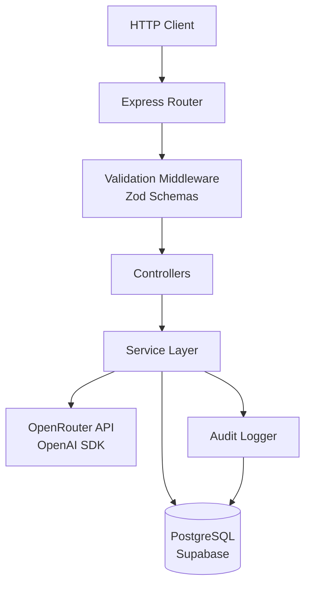
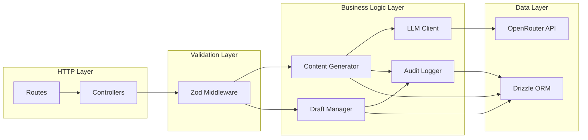
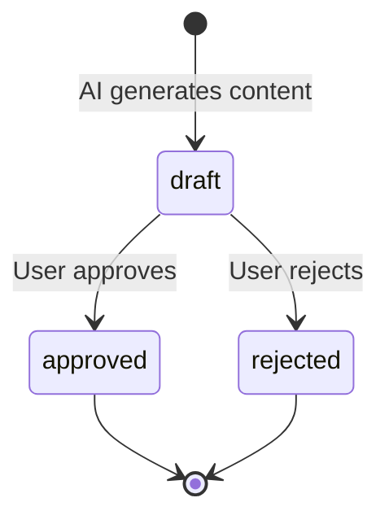
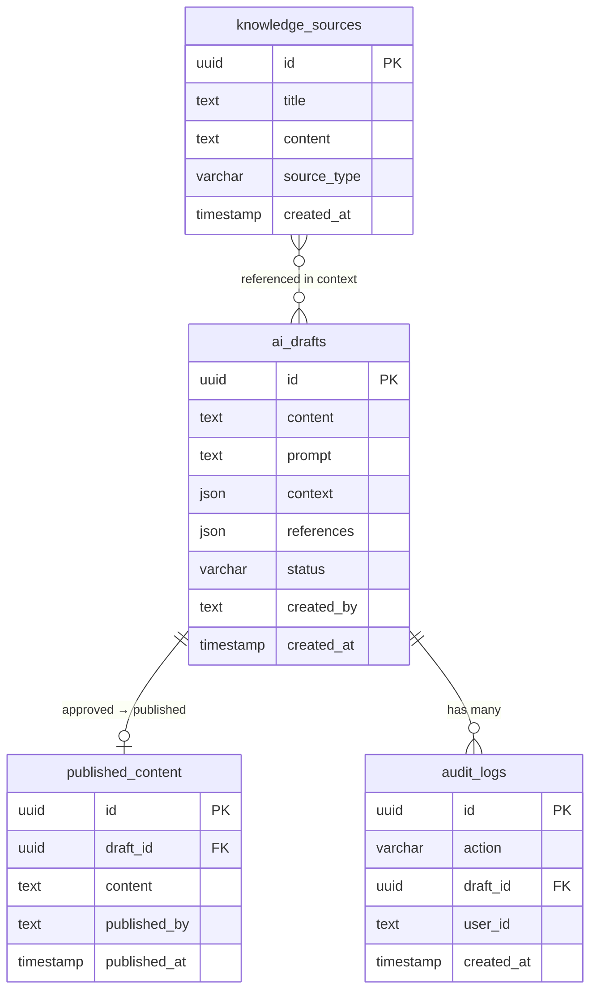
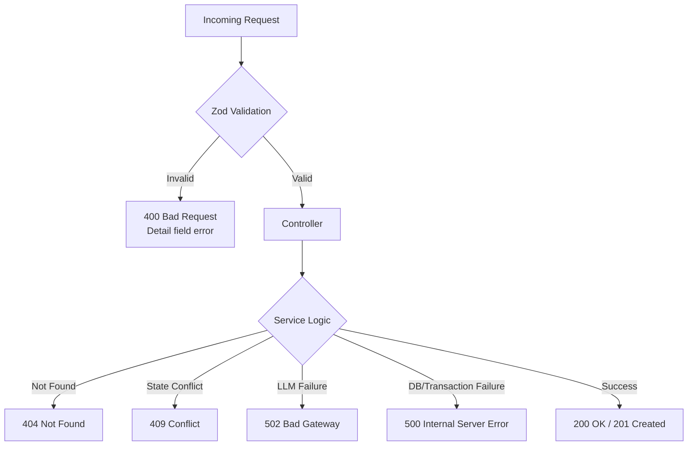

# Dokumen Desain: AI Content Pipeline

## Overview

AI Content Pipeline adalah sistem backend berbasis Express.js + TypeScript yang memungkinkan user meminta AI (via OpenRouter API) menghasilkan konten berdasarkan knowledge base. Konten disimpan sebagai draft, lalu melalui proses approval sebelum dipublikasikan. Prinsip utama: AI hanya menulis ke draft — publikasi hanya melalui aksi manusia.

### Masalah Codebase Saat Ini

Codebase saat ini memiliki beberapa masalah kritis yang harus diperbaiki:

1. **Konflik ESM/CJS**: `package.json` menggunakan `"type": "commonjs"` tapi `tsconfig.json` menggunakan `"verbatimModuleSyntax": true` dengan `"module": "nodenext"`. Ini menyebabkan error di semua file karena ESM import syntax tidak diizinkan di CommonJS module.
2. **Bug di `src/modules/ai/service.ts`**: Unreachable code setelah `throw`, variabel `messages` tidak terdefinisi.
3. **Bug di `src/modules/publish/service.ts`**: `db.query.aiDrafts` tidak berfungsi karena schema tidak di-pass ke `drizzle()`.
4. **Missing packages**: `openai` dan `@types/pg` belum terinstall.
5. **Unknown tsconfig option**: `noUncheckedSideEffectImports` tidak dikenali oleh TypeScript versi yang digunakan.
6. **Missing table**: Tabel `knowledge_sources` belum ada di schema.
7. **Tidak ada routes**: Tidak ada route/controller yang terhubung ke Express app.
8. **Folder kosong**: `src/controllers`, `src/modules/drafts`, `src/utils`, `src/routes` kosong.

### Solusi Module System

Ubah project ke ESM penuh:

- Ubah `package.json` → `"type": "module"`
- Pertahankan `"verbatimModuleSyntax": true` dan `"module": "nodenext"` di tsconfig
- Semua import menggunakan ESM syntax (`import`/`export`)
- Tambahkan ekstensi `.js` pada relative imports (requirement dari NodeNext module resolution)
- Ganti `ts-node-dev` dengan `tsx` untuk dev server (lebih baik support ESM)

### Solusi tsconfig

```jsonc
{
  "compilerOptions": {
    "rootDir": "./src",
    "outDir": "./dist",
    "module": "nodenext",
    "target": "esnext",
    "moduleDetection": "force",
    "types": ["node"],
    "lib": ["esnext"],
    "sourceMap": true,
    "declaration": true,
    "declarationMap": true,
    "noUncheckedIndexedAccess": true,
    "strict": true,
    "verbatimModuleSyntax": true,
    "isolatedModules": true,
    "skipLibCheck": true,
    "esModuleInterop": false,
  },
  "include": ["src/**/*"],
  "exclude": ["node_modules", "dist"],
}
```

Perubahan kunci:

- Hapus `"exactOptionalPropertyTypes"` (terlalu ketat untuk fase awal)
- Hapus `"noUncheckedSideEffectImports"` (unknown option)
- Hapus `"jsx": "react-jsx"` (ini backend, bukan React)
- Tambahkan `"types": ["node"]` dan `"lib": ["esnext"]`
- Aktifkan `rootDir` dan `outDir`

---

## Architecture

### Arsitektur Keseluruhan



### Struktur Project yang Diperbaiki

```
src/
├── index.ts                    # Express app setup + route mounting
├── db/
│   ├── client.ts               # Drizzle client dengan schema
│   └── schema.ts               # Semua tabel: aiDrafts, publishedContent, knowledgeSources, auditLogs
├── routes/
│   ├── ai.routes.ts            # POST /ai/generate, GET /ai/drafts, POST /ai/drafts/:id/approve, POST /ai/drafts/:id/reject
│   └── knowledge.routes.ts     # CRUD knowledge sources (opsional, seed via drizzle)
├── controllers/
│   ├── ai.controller.ts        # Handler untuk AI generation
│   └── draft.controller.ts     # Handler untuk draft management (list, approve, reject)
├── services/
│   ├── content-generator.ts    # Ambil knowledge, bangun konteks, panggil LLM, simpan draft
│   ├── draft-manager.ts        # List, approve, reject draft dengan state machine
│   ├── llm-client.ts           # OpenAI SDK wrapper untuk OpenRouter
│   └── audit-logger.ts         # Catat semua aksi ke tabel audit_logs
├── validation/
│   └── schemas.ts              # Zod schemas untuk semua endpoint
├── middleware/
│   └── validate.ts             # Generic Zod validation middleware
└── types/
    └── index.ts                # Shared TypeScript types
```

Perubahan dari struktur lama:

- Hapus `src/modules/` (flat structure lebih sederhana untuk project ini)
- Hapus `src/utils/` (kosong, tidak perlu)
- Pisahkan `services/` dari `controllers/` dengan jelas
- Tambahkan `validation/` dan `middleware/` untuk Zod
- Tambahkan `types/` untuk shared types

### Layer Architecture



---

## Components and Interfaces

### 1. LLM Client (`services/llm-client.ts`)

Wrapper tipis di atas OpenAI SDK yang dikonfigurasi untuk OpenRouter.

```typescript
// Interface
interface LLMClient {
  generate(prompt: string, context: string): Promise<string>;
}
```

- Menggunakan `openai` SDK dengan `baseURL: "https://openrouter.ai/api/v1"`
- Model fallback: coba model pertama, jika gagal coba model berikutnya
- Membangun messages array dengan system prompt yang membatasi AI ke konteks yang diberikan
- Mengembalikan string content dari response, atau throw error jika semua model gagal

### 2. Content Generator (`services/content-generator.ts`)

Orchestrator utama untuk generasi konten.

```typescript
interface GenerateRequest {
  prompt: string;
  userId: string;
}

interface GenerateResult {
  draftId: string;
  content: string;
  status: "draft";
}

interface ContentGenerator {
  generate(request: GenerateRequest): Promise<GenerateResult>;
}
```

Flow:

1. Ambil semua knowledge sources dari DB
2. Bangun context string dari knowledge sources
3. Panggil LLM Client dengan prompt + context
4. Simpan hasil ke `ai_drafts` dengan metadata lengkap
5. Catat audit log "created"
6. Return draft info

### 3. Draft Manager (`services/draft-manager.ts`)

Mengelola lifecycle draft dengan state machine ketat.

```typescript
interface DraftManager {
  listDrafts(): Promise<AiDraft[]>;
  approveDraft(draftId: string, userId: string): Promise<void>;
  rejectDraft(draftId: string, userId: string): Promise<void>;
}
```

State machine:



- `approveDraft`: Dalam satu transaction → insert ke `published_content` + update status ke "approved" + audit log
- `rejectDraft`: Update status ke "rejected" + audit log
- Validasi state: hanya "draft" yang bisa di-transition. Status "approved" atau "rejected" → 409 Conflict

### 4. Audit Logger (`services/audit-logger.ts`)

```typescript
type AuditAction = "created" | "approved" | "rejected";

interface AuditLogger {
  log(action: AuditAction, draftId: string, userId: string): Promise<void>;
}
```

- Simpan ke tabel `audit_logs` di database
- Setiap entry: action, draft_id, user_id, timestamp

### 5. Validation Middleware (`middleware/validate.ts`)

Generic middleware yang menerima Zod schema dan memvalidasi request.

```typescript
function validate(schema: ZodSchema): RequestHandler;
```

- Validasi `req.body` dan/atau `req.params`
- Jika gagal → 400 dengan detail error dari Zod
- Jika berhasil → lanjut ke controller

### 6. Zod Schemas (`validation/schemas.ts`)

```typescript
// POST /ai/generate
const generateSchema = z.object({
  body: z.object({
    prompt: z.string().min(1, "Prompt wajib diisi"),
    userId: z.string().min(1, "User ID wajib diisi"),
  }),
});

// POST /ai/drafts/:id/approve & reject
const draftActionSchema = z.object({
  params: z.object({
    id: z.string().uuid("ID harus UUID yang valid"),
  }),
  body: z.object({
    userId: z.string().min(1, "User ID wajib diisi"),
  }),
});
```

### 7. Controllers

Controllers tipis yang hanya menjembatani HTTP request ke service layer.

```typescript
// ai.controller.ts
async function generateContent(req: Request, res: Response): Promise<void>;

// draft.controller.ts
async function listDrafts(req: Request, res: Response): Promise<void>;
async function approveDraft(req: Request, res: Response): Promise<void>;
async function rejectDraft(req: Request, res: Response): Promise<void>;
```

### 8. Routes (`routes/ai.routes.ts`)

```
POST   /ai/generate           → validate(generateSchema) → generateContent
GET    /ai/drafts              → listDrafts
POST   /ai/drafts/:id/approve → validate(draftActionSchema) → approveDraft
POST   /ai/drafts/:id/reject  → validate(draftActionSchema) → rejectDraft
```

---

## Data Models

### Database Schema (Drizzle ORM)

#### Tabel `ai_drafts`

```typescript
export const aiDrafts = pgTable("ai_drafts", {
  id: uuid("id").defaultRandom().primaryKey(),
  content: text("content").notNull(),
  prompt: text("prompt").notNull(),
  context: json("context").$type<Record<string, unknown>>(),
  references: json("references").$type<string[]>(),
  status: varchar("status", { length: 20 }).notNull().default("draft"),
  createdBy: text("created_by").notNull(),
  createdAt: timestamp("created_at").defaultNow().notNull(),
});
```

Perubahan dari schema lama:

- Tambahkan `.notNull()` pada field kritis (`content`, `prompt`, `status`, `createdBy`, `createdAt`)
- Tambahkan `$type<>()` untuk type safety pada JSON fields

#### Tabel `published_content`

```typescript
export const publishedContent = pgTable("published_content", {
  id: uuid("id").defaultRandom().primaryKey(),
  draftId: uuid("draft_id").notNull().unique(),
  content: text("content").notNull(),
  publishedBy: text("published_by").notNull(),
  publishedAt: timestamp("published_at").defaultNow().notNull(),
});
```

Perubahan:

- `draftId` menjadi `.notNull().unique()` — satu draft hanya bisa menghasilkan satu published content (mencegah duplikasi)
- Tambahkan `.notNull()` pada field kritis

#### Tabel `knowledge_sources` (BARU)

```typescript
export const knowledgeSources = pgTable("knowledge_sources", {
  id: uuid("id").defaultRandom().primaryKey(),
  title: text("title").notNull(),
  content: text("content").notNull(),
  sourceType: varchar("source_type", { length: 50 }).notNull(),
  createdAt: timestamp("created_at").defaultNow().notNull(),
});
```

#### Tabel `audit_logs` (BARU)

```typescript
export const auditLogs = pgTable("audit_logs", {
  id: uuid("id").defaultRandom().primaryKey(),
  action: varchar("action", { length: 20 }).notNull(),
  draftId: uuid("draft_id").notNull(),
  userId: text("user_id").notNull(),
  createdAt: timestamp("created_at").defaultNow().notNull(),
});
```

### Drizzle Client Fix

```typescript
// src/db/client.ts
import { drizzle } from "drizzle-orm/node-postgres";
import pg from "pg";
import * as schema from "./schema.js";

const pool = new pg.Pool({
  connectionString: process.env.DATABASE_URL,
});

export const db = drizzle(pool, { schema });
```

Perubahan kunci:

- Pass `{ schema }` ke `drizzle()` — ini memperbaiki error `db.query.aiDrafts`
- Import `pg` sebagai default import (ESM compatible)
- Tambahkan `.js` extension pada relative import

### Entity Relationship Diagram



### Package Dependencies yang Perlu Ditambahkan

```json
{
  "dependencies": {
    "openai": "^4.x"
  },
  "devDependencies": {
    "@types/pg": "^8.x",
    "@types/node": "^22.x",
    "tsx": "^4.x",
    "fast-check": "^4.x",
    "vitest": "^3.x"
  }
}
```

- `openai`: SDK untuk memanggil OpenRouter API
- `@types/pg`: Type declarations untuk `pg` package
- `@types/node`: Type declarations untuk Node.js built-ins
- `tsx`: Pengganti `ts-node-dev` yang lebih baik support ESM
- `fast-check`: Library property-based testing
- `vitest`: Test runner modern yang support ESM native

---

## Correctness Properties

_Property adalah karakteristik atau perilaku yang harus berlaku di semua eksekusi valid dari sebuah sistem — pada dasarnya, pernyataan formal tentang apa yang harus dilakukan sistem. Property menjembatani spesifikasi yang bisa dibaca manusia dengan jaminan kebenaran yang bisa diverifikasi mesin._

### Property 1: Context building menyertakan semua knowledge sources

_For any_ kumpulan knowledge sources di database, ketika fungsi buildContext dipanggil, string context yang dihasilkan harus mengandung content dari setiap knowledge source.

**Validates: Requirements 1.2**

### Property 2: Draft baru selalu memiliki status "draft" dan metadata lengkap

_For any_ draft yang baru dibuat melalui Content_Generator, draft tersebut harus memiliki status "draft" dan semua field metadata terisi: prompt (non-empty), context (JSON), references (JSON array), created_by (non-empty), dan created_at (valid timestamp).

**Validates: Requirements 1.3, 1.4, 2.2, 10.1, 10.2, 10.3, 10.4, 10.5**

### Property 3: AI generation hanya menulis ke ai_drafts

_For any_ operasi generate, jumlah record di tabel published_content sebelum dan sesudah operasi harus sama. Hanya tabel ai_drafts yang boleh bertambah.

**Validates: Requirements 2.1**

### Property 4: List drafts mengembalikan semua draft dengan field lengkap

_For any_ kumpulan N draft yang di-insert ke database, pemanggilan listDrafts harus mengembalikan tepat N items, dan setiap item harus memiliki semua field: id, content, prompt, context, references, status, created_by, created_at.

**Validates: Requirements 3.1, 3.2**

### Property 5: State machine hanya mengizinkan transisi valid

_For any_ draft dengan status S dan target status T, transisi hanya berhasil jika S = "draft" dan T ∈ {"approved", "rejected"}. Semua kombinasi lain (termasuk "approved" → _, "rejected" → _) harus ditolak dengan error 409.

**Validates: Requirements 6.1, 6.2, 6.3, 4.2, 4.6, 5.2, 5.5**

### Property 6: Approve menghasilkan published_content yang konsisten

_For any_ draft yang berhasil di-approve, tabel published_content harus memiliki tepat satu record baru dengan draft_id yang sesuai, content yang sama dengan draft, published_by yang sesuai dengan userId, dan published_at yang valid.

**Validates: Requirements 4.3, 4.4**

### Property 7: Operasi pada draft yang tidak ada mengembalikan 404

_For any_ UUID yang tidak ada di tabel ai_drafts, operasi approve dan reject harus mengembalikan error dengan HTTP status 404.

**Validates: Requirements 4.5, 5.4**

### Property 8: Operasi pada draft yang sudah diproses tidak mengubah data

_For any_ draft yang sudah berstatus "approved" atau "rejected", mengirim approve atau reject harus mengembalikan 409, dan state database (ai_drafts + published_content) harus tetap sama sebelum dan sesudah operasi.

**Validates: Requirements 7.1, 7.2, 7.3, 7.4**

### Property 9: Setiap aksi menghasilkan audit log entry

_For any_ aksi (create, approve, reject) pada draft, tabel audit_logs harus memiliki entry baru dengan action yang sesuai, draft_id yang benar, user_id yang benar, dan timestamp yang valid.

**Validates: Requirements 9.1, 9.2, 9.3**

### Property 10: Invalid input ditolak dengan 400 dan detail error

_For any_ request dengan input yang tidak valid (prompt kosong, UUID tidak valid, userId missing), sistem harus mengembalikan HTTP 400 dengan response body yang mengandung informasi tentang field yang gagal validasi.

**Validates: Requirements 12.1, 12.2, 12.3, 12.4, 1.6**

### Property 11: References menyertakan source_type dari knowledge sources

_For any_ draft yang dibuat, field references harus mengandung source_type dari setiap knowledge source yang digunakan dalam konteks.

**Validates: Requirements 11.3**

---

## Error Handling

### Strategi Error Handling

Sistem menggunakan pendekatan error handling berlapis:



### Error Response Format

Semua error response menggunakan format konsisten:

```typescript
interface ErrorResponse {
  error: string; // Pesan error yang deskriptif
  details?: unknown; // Detail tambahan (Zod errors, dll)
}
```

### Error Codes per Endpoint

| Endpoint                    | Status | Kondisi                                           |
| --------------------------- | ------ | ------------------------------------------------- |
| POST /ai/generate           | 400    | Prompt kosong, userId missing, format tidak valid |
| POST /ai/generate           | 502    | Semua LLM model gagal                             |
| POST /ai/generate           | 500    | Database error saat simpan draft                  |
| GET /ai/drafts              | 200    | Selalu sukses (array kosong jika tidak ada draft) |
| POST /ai/drafts/:id/approve | 400    | ID bukan UUID valid, userId missing               |
| POST /ai/drafts/:id/approve | 404    | Draft tidak ditemukan                             |
| POST /ai/drafts/:id/approve | 409    | Draft sudah approved/rejected                     |
| POST /ai/drafts/:id/approve | 500    | Transaction gagal                                 |
| POST /ai/drafts/:id/reject  | 400    | ID bukan UUID valid, userId missing               |
| POST /ai/drafts/:id/reject  | 404    | Draft tidak ditemukan                             |
| POST /ai/drafts/:id/reject  | 409    | Draft sudah approved/rejected                     |

### Error Handling di Service Layer

```typescript
// Custom error classes
class NotFoundError extends Error {
  statusCode = 404;
}

class ConflictError extends Error {
  statusCode = 409;
}

class LLMError extends Error {
  statusCode = 502;
}
```

Controllers menangkap error dari service dan mengembalikan HTTP response yang sesuai:

```typescript
// Pattern di controller
try {
  const result = await service.doSomething(params);
  res.status(200).json(result);
} catch (error) {
  if (error instanceof NotFoundError) {
    res.status(404).json({ error: error.message });
  } else if (error instanceof ConflictError) {
    res.status(409).json({ error: error.message });
  } else if (error instanceof LLMError) {
    res.status(502).json({ error: error.message });
  } else {
    res.status(500).json({ error: "Internal server error" });
  }
}
```

### Transaction Error Recovery

Untuk operasi approve yang menggunakan database transaction:

1. Drizzle ORM `db.transaction()` otomatis rollback jika callback throw error
2. Jika insert ke `published_content` gagal → rollback, status draft tetap "draft"
3. Jika update status `ai_drafts` gagal → rollback, record published_content tidak tersimpan
4. Controller menangkap error dan mengembalikan 500

---

## Testing Strategy

### Framework dan Library

- **Test Runner**: Vitest (native ESM support, fast, compatible dengan project ini)
- **Property-Based Testing**: fast-check (library PBT paling mature untuk JavaScript/TypeScript)
- **Minimum Iterasi**: 100 iterasi per property test

### Dual Testing Approach

#### Unit Tests

Unit tests fokus pada:

- Specific examples yang mendemonstrasikan behavior yang benar
- Edge cases: empty database, invalid UUIDs, empty prompts
- Error conditions: LLM failure, database failure, transaction rollback
- Integration points: controller → service → database

Contoh unit test scenarios:

- Generate dengan prompt valid → draft tersimpan
- Approve draft yang sudah approved → 409
- List drafts saat database kosong → array kosong
- Validasi Zod menolak prompt kosong → 400 dengan detail

#### Property-Based Tests

Setiap correctness property di atas diimplementasikan sebagai satu property-based test menggunakan fast-check.

Konfigurasi:

```typescript
import { fc } from "fast-check";

// Setiap test minimal 100 iterasi
fc.assert(
  fc.property(
    fc.string({ minLength: 1 }), // generator
    (input) => {
      // property assertion
    },
  ),
  { numRuns: 100 },
);
```

Tag format untuk setiap test:

```typescript
// Feature: ai-content-pipeline, Property 1: Context building menyertakan semua knowledge sources
```

#### Mapping Property Tests ke Properties

| Property    | Test Description          | Generator Strategy                                                        |
| ----------- | ------------------------- | ------------------------------------------------------------------------- |
| Property 1  | Context building          | Generate random arrays of knowledge source objects                        |
| Property 2  | Draft metadata            | Generate random valid prompts dan userIds                                 |
| Property 3  | Write boundary            | Generate random generate requests, verify published_content unchanged     |
| Property 4  | List completeness         | Generate random N, insert N drafts, verify list returns N with all fields |
| Property 5  | State machine             | Generate random (status, targetStatus) pairs, verify transition rules     |
| Property 6  | Approve consistency       | Generate random drafts, approve, verify published_content                 |
| Property 7  | 404 on missing            | Generate random UUIDs, verify 404                                         |
| Property 8  | Idempotency               | Generate random drafts, process, re-process, verify no data change        |
| Property 9  | Audit logging             | Generate random actions, verify audit_logs entries                        |
| Property 10 | Input validation          | Generate random invalid inputs (empty strings, non-UUID, missing fields)  |
| Property 11 | Source type in references | Generate random knowledge sources with various source_types               |

### Test Structure

```
tests/
├── unit/
│   ├── content-generator.test.ts
│   ├── draft-manager.test.ts
│   ├── llm-client.test.ts
│   ├── audit-logger.test.ts
│   └── validation.test.ts
└── properties/
    ├── context-building.prop.test.ts
    ├── draft-lifecycle.prop.test.ts
    ├── state-machine.prop.test.ts
    ├── write-boundary.prop.test.ts
    ├── audit-logging.prop.test.ts
    └── validation.prop.test.ts
```
